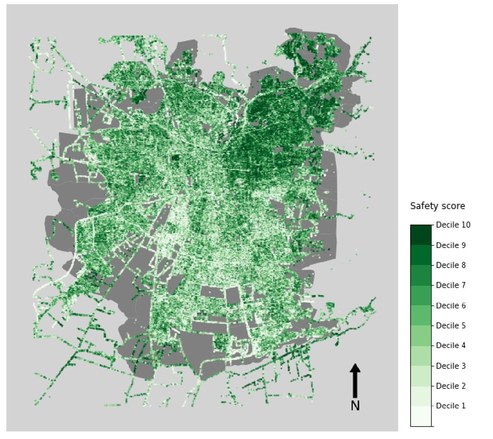
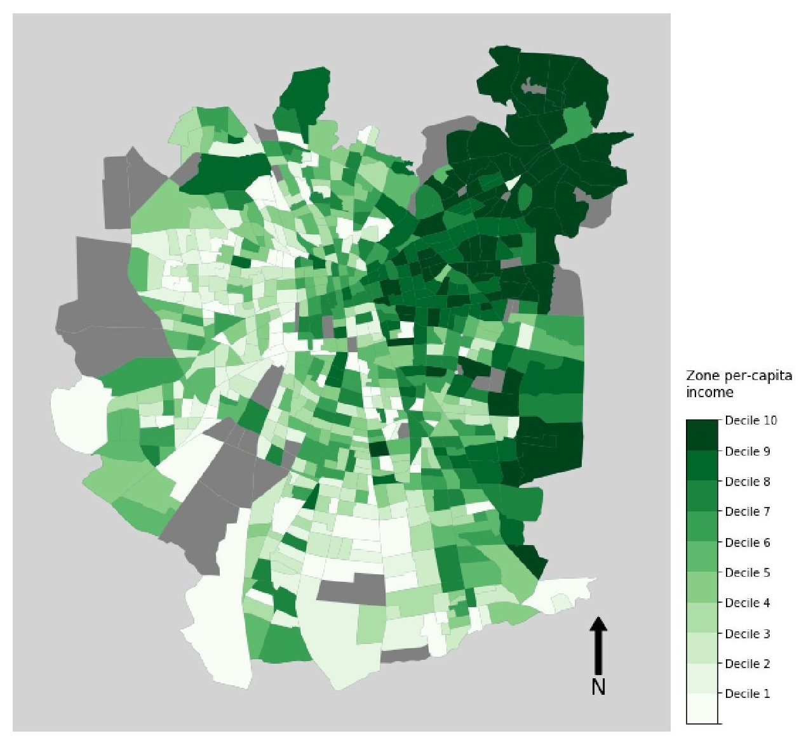
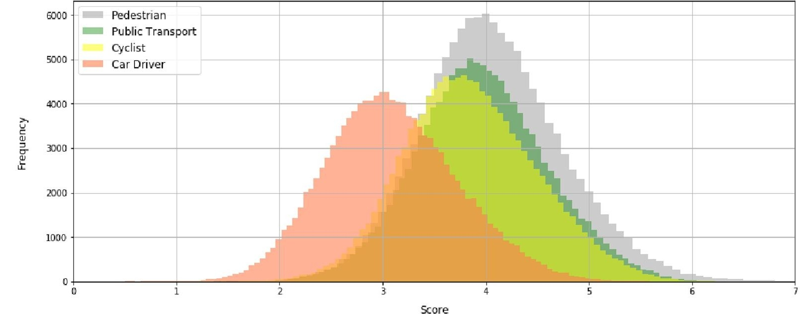
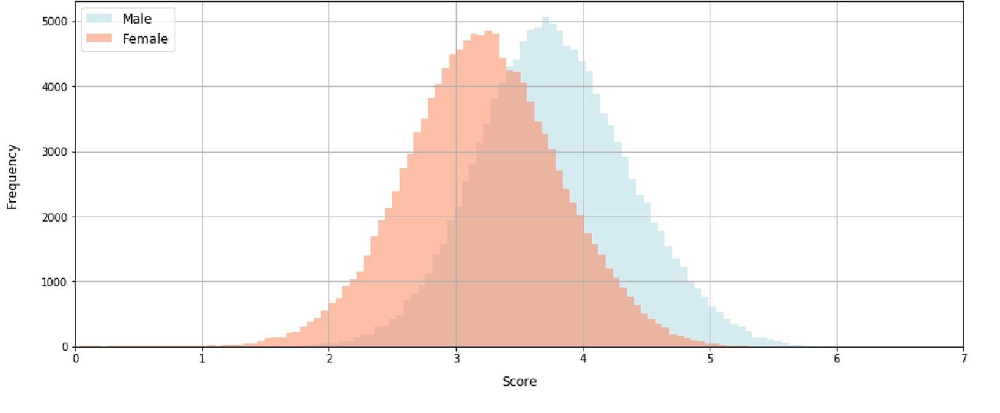

# msc-eng-thesis

## Table of Contents
```
. 
├───analysis
├───models
└───utils
    └───wekun_object_detection.py
```

## Instalation
```
conda create -p ./env
conda activate ./env
pip install biogeme
conda install -c conda-forge --prefix ./env ipykernel -y
```

## See Also
* [Online image-base survey template](https://github.com/tiramirez/flask-image-based-survey)
* [Thesis Dataset](https://ricardohurtubia.wordpress.com/2020/07/22/dataset-perception-of-urban-space/)
*  Publications
> **Ramírez, T.**, Hurtubia, R., Lobel, H., \& Rossetti, T. (2021). Measuring heterogeneous perception of urban space with massive data and machine learning: An application to safety. Landscape and Urban Planning, 208, 104002.\\ https://doi.org/10.1016/j.landurbplan.2020.104002

## Title
Measuring heterogeneous perception of urban space with massive data and machine learning

## Abstract
Over the last 60 years, various methodologies have been proposed to understand the effects of the landscape on the evaluation of those who inhabit it, however, each one of them presents important disadvantages at an individual level. The use of qualitative interviews has allowed studies of great depth at the level of individuals, but with low scalability due to the high costs in its execution and its results are hardly generalizable. The use of declared preference surveys increases the scope of the studies but sacrificing the number of variables analyzed. In the last decade, large databases of street imagery and machine learning development have allowed to increase scalability of methodologies to understand the effects of the landscape on the evaluation of those who inhabit it. However, these new methodologies have not incorporated the analysis of heterogeneous behaviors, although gender differences on perception of safety have been widely studied in social science and urban planning in lower scale studies.

In the present study, computational and statistical tools are combined to achieve a methodological proposal of high scalability whose results allow observing heterogeneous behaviors against specific elements of the landscape. To achieve this, a new survey of perception of public spaces was implemented, with which responses are collected on the perception of public spaces accompanied by a sociodemographic characterization of the observer. Then the process of parameterization of the images previously used in the literature was complemented by an object detection algorithm. Our results show heterogeneity in the perception of public spaces according to gender and observer mobility patterns. These results have also allowed us to explore the application of the models for the city of Santiago to test their use as a tool to support urban planners in the detection of problem areas for some population groups.

## Results: How safe looks Santiago de Chile?

The perception of Chile's capital has a strong correlation with the distribution of its income. This findings, althought expected, are interesting since the survey had not a single image of Chile. All images were taken from other countries (North America, Europe and Asia) and then the pictures from Santiago are evaluated with the parameters of the trained model. 

Scores from Model             |  Dist. of Per-capita Income
:-------------------------:|:-------------------------:
  |  

## Results: How different car drivers perceive the city in comparison to active mode users?


## Results: How different is the perception of men and women?

